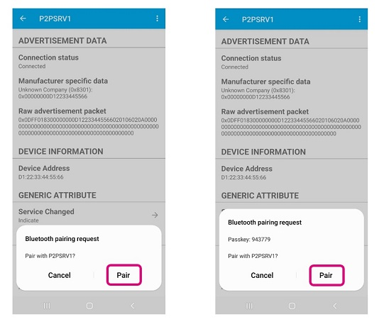
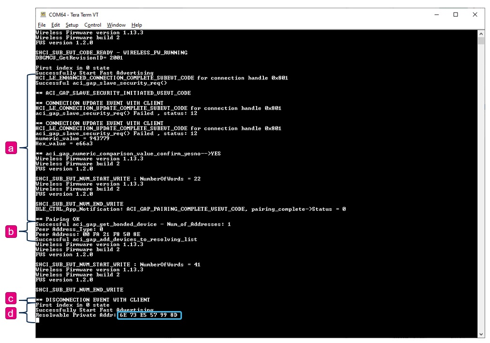

# STM32-Hotspot/STM32WB-BLE-Privacy MCU Firmware Package, based on STM32CubeWB Release 1.13.3

## Example

This Hotspot FW package includes:
* Application example under "Projects\P-NUCLEO-WB55.Nucleo\Applications\BLE" called BLE_ResolvablePrivateAddress.     
   * This example implements a GAP Peripheral device with Bluetooth LE Privacy feature enabled to demonstrate advertising with a Resolvable Private Address.  
   * One STM32WB55xx board is used, acting as GAP peripheral and GATT server 
   * One Android smartphone is used, acting as GAP Central/GATT client. On the Android Smartphone, an app like Punchthrough LightBlue can be used for demonstration but similar apps can be used as well. Note that an Android device is preferred to use over iOS device for demontration purposes of the Resolvable Private Address (RPA) privacy feature because Android allows reading the MAC address from the advertising packets and display it on the scan window, while iOS does not allow this. 
   * Development tools, toolchains/compilers: IAR EWARM V9.20.4, STM32CubeIDE v1.8.0
   * Supported Devices and hardware boards: NUCLEO-WB55RG (MB1355)
   * Known limitations: None

## Boards Needed

  * One NUCLEO-WB55RG (MB1355)
    * [NUCLEO-WB55RG](https://www.st.com/en/evaluation-tools/nucleo-wb55rg.html)

## User's Guide 

* [1] Install the Punchthrough LightBlue app on a smartphone.
* [2] Install stm32wb5x_BLE_Stack_full_extended_fw.bin binary on the STM32WB Wireless Coprocessor, from STM32CubeWB v1.13.3. 
* [3] Build, program, and run the BLE_ResolvablePrivateAddress application on the NUCLEO-WB55RG.
* [4] The STM32WB55 GAP Peripheral device is configured with a Random Static Address (D1:22:33:44:55:66), with privacy enabled and own MAC address set as Resolvable Private Address (RPA), however, the first time it advertises it does so with known Random Static Address (RSA).
* [5] From the LightBlue app, on the Android Smartphone Central, perform a scan to discover the STM32WB GAP peripheral.  The device should be easy to find based on the name and address which both should be shown. Notice the device MAC address found in the advertising packet is the Random Static Address (D1:22:33:44:55:66), this is because the Peripheral has not yet bonded with any Centrals yet, meaning there's no Centrals that have its Identity Resolving Key (IRK) to resolve the RPA. 
* [6] Tap the "P2PSRV1" device to connect. 

 
	* After the connection is established, the STM32WB device will automatically initiate a pairing request (w/ Numerical Comparison method), so accept the pairing requests from the app when prompted. During the pairing (bonding) procedure, the STM32WB shares the IRK with the Central, which enables the Central to resolve/decode the RPA from it in subsequent advertising events.

	* (b) After the pairing procedure, the STM32WB peripheral automatically reads the address of the bonded device (Smartphone's Bluetooth MAC address) and adds it to its "resolving list".  When the resolving list contains at least one peer address, it enables the peripheral to advertise with an RPA thereafter. Again, if the resolving list contains no peer addresses, the device advertises with the Static Random Address. The Central should also take care of adding the peer address to its resolving list in order for it to be able to discover and resolve it on subsequent times when the bonded Peripheral is advertising with an RPA. 

* [7] (c) Disconnect the link from the smartphone LightBlue app 
* [8] (d) The STM32WB peripheral will restart advertising with an RPA. You can verify this by reading the local RPA or with a second unbonded smartphone, notice the address is the RPA and only the previously bonded Central shows the original Random Static Address which means attackers could no longer use a sniffer to track the location of the device over time since the RPA is random and continously changing. 

* [9] For the case when you want to connect and bond with a second Smartphone Central, the STM32WB Peripheral will have to clear its resolving list and restart advertising with the known Random Static Address. You can do this by pressing SW1 on the NUCLEO-WB55RG board. 
* [10] You should see reflected on the unbonded Smarphone
* [11] From the unbonded second Smartphone Lightblue app, connect and pair (bond) 
* [12] Disconnect the link from the second Smartphone. 
* [13] The STM32WB peripheral will once again start advertising with an RPA.    
* [14] You can re-add the peer address of the first Smartphone by pressing SW3. 
* [15] Now, only the two bonded Smartphones will be able to resolve the Peripherals RPA that the device is advertising. 
 

## Troubleshooting

**Caution** : Issues and the pull-requests are **not supported** to submit problems or suggestions related to the software delivered in this repository. The STM32WB-BLE-Privacy example is being delivered as-is, and not necessarily supported by ST.

**For any other question** related to the product, the hardware performance or characteristics, the tools, the environment, you can submit it to the **ST Community** on the STM32 MCUs related [page](https://community.st.com/s/topic/0TO0X000000BSqSWAW/stm32-mcus).
